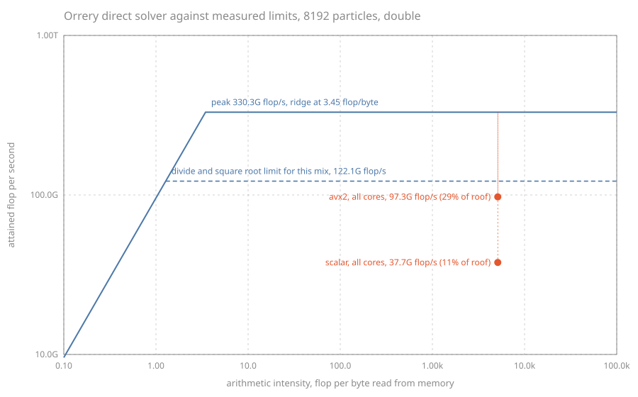

# Vectorisation, and the kernels against this machine's measured limits

Measured on the machine [the performance report](../performance.md) describes.

The short version, in three findings.

Vectorising the direct kernel with AVX2 makes it 3.34 times faster on one core
in double precision and 6.36 times faster in single, against vector widths of
four and eight. It also makes it about three and a half times *more* accurate,
which is not a trade-off anybody had to make and is explained below.

This machine's real ceilings are not the ones on the specification sheet. It
sustains 95.7 GB/s of read bandwidth against a nominal 135, and 330 Gflop/s of
fused multiply-add in double precision.

And the direct solver is bound by neither. It is bound by the throughput of
square roots and divisions, of which it performs two in every twenty
floating-point operations, and against *that* ceiling the vectorised threaded
kernel reaches 80 per cent. That is the number this phase is really reporting,
and the argument for why it is the right one is the substance of this document.



## The machine and the method

| Property | Value |
| --- | --- |
| CPU | Intel Core Ultra 5 238V, 4 Lion Cove plus 4 Skymont, 8 threads |
| Build | `RelWithDebInfo`, Clang 22.1.8, no fast-math flag anywhere |
| Power | Mains, Windows power mode set to best performance |
| Configuration | Plummer sphere, 8192 particles, seed 20260810, softening 0.05 |
| Protocol | 21 timed trials after a settling warm-up, median reported |

Every figure below comes from `benchmarks/harness/`, whose methodology ADR-0019
records: the median of repeated trials rather than the best of them, an
interquartile range beside every median, a drift figure comparing the second
half of a run against the first, a cool-down between configurations, and a
thermal canary bracketing the whole session. Reproduce with:

```
cmake --preset release
cmake --build --preset release
./build/release/benchmarks/orrery_roofline 8192 21
```

The program writes `roofline.svg` and `roofline.csv` into the current directory,
and the copies here are the ones from the session recorded below.

**Read the spread column.** These are wall times on a laptop, and a figure with
a twenty per cent interquartile range does not support a conclusion that a three
per cent figure would. What that means in practice is set out in
[How much of this is reproducible](#how-much-of-this-is-reproducible), which is
not an appendix but part of the result.

## The ceilings

Session of 2026-08-10 19:08, double precision.

| Probe | Sustained | Spread | Drift | Best trial |
| --- | --- | --- | --- | --- |
| Read bandwidth | 95.68 GB/s | 1.5% | 0.9% | 97.50 GB/s |
| Triad bandwidth | 75.23 GB/s | 1.3% | 0.9% | 76.20 GB/s |
| Fused multiply-add | 330.25 Gflop/s | 2.2% | -0.4% | 335.62 Gflop/s |
| Divide and square root | 12.21 Gop/s | 3.3% | 1.2% | 12.60 Gop/s |

The bandwidth figures are worth comparing with the nominal one. The
manufacturer's figure for this part is approximately 135 GB/s, shared between
the CPU and the integrated GPU. A read-only stream over a buffer sixty-four
times the size of the last-level cache reaches 95.7 GB/s, which is 71 per cent
of it. That is an ordinary result for a real program, and it is the number this
project quotes from here on. A roofline drawn against 135 would place every
kernel further below the line than it is, and would attribute the difference to
the kernel rather than to the memory controller.

The triad is lower, at 75.2 GB/s, which is what writing as well as reading
costs. The count is the STREAM convention of three bytes per element, two read
and one written; on this and every other write-allocate machine the true traffic
is four, because storing to a line not already in cache fetches it first. The
convention is stated so that the figure can be converted rather than guessed at.

The two arithmetic ceilings are the point of this section. 330 Gflop/s of fused
multiply-add is the number a specification sheet would quote and the one every
published peak figure uses. 12.2 Gop/s of square roots and divisions is the
number that decides how fast this project's kernel can run. The ratio between
them is 27 to one.

That ratio is not a defect. Multiply-add is what a processor builds many wide
pipelines for; division and square root go to one unit that is only partly
pipelined, on every x86 part made in the last twenty years. A kernel needing one
of each per interaction competes for that unit and for nothing else.

## What one interaction costs

Every rate here is formed from a count of operations, so the count has to be
stated rather than assumed. One pairwise interaction performs:

| Step | Operations |
| --- | --- |
| Three subtractions for the separation vector | 3 |
| Three multiplies and two adds for its square | 5 |
| One add for the softening | 1 |
| One square root | 1 |
| One division | 1 |
| Two multiplies for the cube of the reciprocal | 2 |
| One multiply by the mass | 1 |
| Three multiplies and three adds to accumulate | 6 |
| **Total** | **20** |

Twenty, counting the square root and the division as one operation each. That is
the convention the N-body literature uses, and it makes these figures comparable
with published ones. It also understates the work, which is exactly why the
second ceiling exists: two of those twenty take a unit the other eighteen do
not, and they are not interchangeable.

The horizontal axis of the plot needs the other half of the accounting. A force
evaluation reads three coordinate arrays and a mass array, `4N` values, and each
is read from memory once however many targets stream over it, because the whole
configuration is a few hundred kilobytes and stays in cache. So the compulsory
traffic is `4N * sizeof(Real)` bytes and the arithmetic intensity is

    20 N (N - 1) / (4 N * 8) = 0.625 (N - 1)  flop per byte

which at 8192 particles is 5119 flop per byte, against a ridge at 3.45. The
direct solver is compute-bound by three and a half orders of magnitude.

That is worth pausing on, because most kernels in this project are bound by data
movement rather than by arithmetic, and that is why the layout
decisions of ADR-0004 exist. Direct summation is the exception, and it is the
exception for the same reason it is expensive: it does N-squared work on N data.

## The kernels

Double precision, same session as the ceilings above:

| Kernel | Threads | Median | Spread | Drift | flop/s | Of peak | Of the divide ceiling |
| --- | --- | --- | --- | --- | --- | --- | --- |
| scalar | 1 | 177.6 ms | 1.9% | -0.1% | 7.56 G | 2.3% | 6.2% |
| scalar | 8 | 35.57 ms | 2.2% | 0.4% | 37.73 G | 11.4% | 30.9% |
| avx2 | 1 | 53.13 ms | 3.5% | -1.6% | 25.26 G | 7.6% | 20.7% |
| avx2 | 8 | **13.80 ms** | 3.7% | 4.0% | **97.27 G** | 29.5% | **79.7%** |
| scalar, repeated at the end | 1 | 178.3 ms | 5.0% | -1.7% | 7.52 G | 2.3% | 6.2% |

Single precision, where the vector is eight lanes wide rather than four. Session
of 2026-08-10 18:52, whose ceilings were 92.38 GB/s read, 570.90 Gflop/s
multiply-add and 27.38 Gop/s divide and square root:

| Kernel | Threads | Median | Spread | Drift | flop/s | Of peak | Of the divide ceiling |
| --- | --- | --- | --- | --- | --- | --- | --- |
| scalar | 1 | 156.0 ms | 6.3% | -0.1% | 8.60 G | 1.5% | 3.1% |
| scalar | 8 | 34.67 ms | 20.6% | 22.9% | 38.71 G | 6.8% | 14.1% |
| avx2 | 1 | 24.53 ms | 15.7% | -6.7% | 54.70 G | 9.6% | 20.0% |
| avx2 | 8 | **7.005 ms** | 14.1% | 3.2% | **191.6 G** | 33.6% | **70.0%** |
| scalar, repeated at the end | 1 | 159.7 ms | 20.7% | -18.4% | 8.40 G | 1.5% | 3.1% |

The derived figures, which are what the phase set out to produce:

| Comparison | Double | Single |
| --- | --- | --- |
| Vectorising, one thread | 3.34x | 6.36x |
| Vectorising, eight threads | 2.58x | 4.95x |
| Threading the vector kernel | 3.85x | 3.50x |
| Threading the scalar kernel | 4.99x | 4.50x |
| Both together | **12.87x** | **22.28x** |

And single precision against double, on the same kernel at full width: 1.97
times faster, which is close to the ratio of the two divide-and-square-root
ceilings, 2.24, and not to the ratio of the vector widths.

Vectorising buys less at eight threads than at one, in both precisions. That is
not the vectorisation failing. It is the two effects meeting: the vector kernel
brings the machine much closer to a ceiling that threading also pushes towards,
so the two cannot both be paid in full.

## Reading the two 'fraction of' columns

The vectorised kernel on all eight cores reaches 29.5 per cent of the fused
multiply-add peak. Taken alone that number invites the conclusion that two
thirds of the machine is being wasted and that there is a great deal left to
win. It is the wrong conclusion, and the second ceiling shows why.

The same kernel reaches 79.7 per cent of the square root and division
throughput. Since it performs two such operations in every twenty, and since
those cannot be issued on the units the other eighteen use, that ceiling bounds
any implementation of this algorithm on this machine. The kernel is at four
fifths of it, and the missing fifth is the eighteen other operations, the loads
and the loop competing for issue slots with the two that matter.

What that means in practice is that further work on this kernel has to change
the arithmetic rather than the code. The routes are known and each is a separate
decision. Approximate the reciprocal square root, which ADR-0020 declines for
now and defers to Phase 9, with the accuracy instrument built here in place to
judge it. Move to single precision, where the same unit is more than twice as
fast and the table above shows the kernel following it almost exactly. Or stop
computing most of the interactions at all, which is Phase 8.

## The vector kernel is more accurate, not less

Reassociating a sum is usually discussed as a cost. It is not one here, and the
measurement is in `tests/solvers/kernel_accuracy_test.cpp`.

Both kernels are compared against `solvers/reference_kernel.hpp`, which computes
the same physics with every term formed in `double` whatever the build's scalar
type, accumulated with Neumaier compensation so that its own summation error is
negligible against what is being measured. Over a 2048-particle Plummer sphere
with seed 20260810, relative to that reference:

| Build | Kernel | Worst relative error | Root mean square |
| --- | --- | --- | --- |
| double | scalar | 3.24e-15 | 8.8e-16 |
| double | avx2 | 9.5e-16 | 2.5e-16 |
| float | scalar | 1.88e-6 | 4.78e-7 |
| float | avx2 | 3.60e-7 | 8.35e-8 |

The vector kernel is better by a factor of 3.5 in double precision and 5.7 in
single. The reason is not subtle: a running sum accumulates rounding error along
its length, and keeping one partial sum per lane turns one sum of n terms into
four or eight sums of n/4 or n/8. The improvement lands between the square root
of the lane count and the lane count itself, which is where a mixture of
systematic and random error should put it.

Neither kernel uses a relaxed floating-point mode. ADR-0020 records that this
project sets no fast-math flag anywhere, and draws the line: reassociation
written by hand across four lanes in one documented file, with the effect
measured, is a decision; the same reassociation granted to an optimiser by a
global flag is not.

## Threading, re-measured with the vector kernel

Phase 6 measured the scheduler on a scalar kernel and ended with a prediction:

> Phase 7 adds explicit AVX2 vectorisation, which will make every core faster
> and may well change the ratio between the two kinds, since Lion Cove and
> Skymont differ more in vector throughput than in scalar. The balance the
> scheduler finds should follow the new ratio without changes, and that is a
> prediction this document is making and Phase 7 can check.

It checks out, and by more than was expected. Session of 2026-08-10 19:00, whose
thermal canary moved 5.2 per cent across the run.

The same evaluation single-threaded, pinned to one core of each kind:

| Core | Median per evaluation | Relative |
| --- | --- | --- |
| Performance (Lion Cove) | 51.5 ms | 1.00 |
| Efficiency (Skymont) | 327.0 ms | 6.34 |

Phase 6 measured that ratio as **2.17** on the scalar kernel. On the vector
kernel it is **6.34**. The efficiency cores are not merely slower at vector
work, they are very much slower, and a kernel spending its time on 256-bit
divisions and square roots is precisely the one that exposes the difference.

That changes what the machine is worth. Eight cores of which four run at a sixth
of the speed are

    4 x 1 + 4 x (1 / 6.34) = 4.63

times one performance core, against 5.84 for the scalar kernel. Vectorising made
the machine faster and made it *less* parallel, and both are real.

| Scheme | Median | Speedup | Fraction of the 4.63 limit | Idle, all | Idle, P cores | Idle, E cores |
| --- | --- | --- | --- | --- | --- | --- |
| Static shares, pinned | 40.60 ms | 1.27x | 27% | 42.1% | **83.4%** | 0.8% |
| Work stealing, pinned | 12.75 ms | 4.04x | 87% | 5.0% | **8.2%** | 1.8% |
| Static shares, free | 14.22 ms | 3.63x | 78% | 23.9% | - | - |
| Work stealing, free | 12.48 ms | 4.13x | 89% | 3.4% | - | - |

The performance cores now idle for 83.4 per cent of a statically partitioned
region, against 64.5 per cent in Phase 6. That is the same failure, made worse
by the same amount the asymmetry grew.

And the scheduler followed it without being told. Under work stealing the
performance cores took 75,776 of the 90,112 particle-evaluations between them
and the efficiency cores 14,336, a ratio of **5.29 to one** against a hardware
ratio of 6.34 measured independently. Phase 6 recorded 2.38 against 2.17.
Nothing in `WorkStealingExecutor` changed between the two measurements, and
nothing in it holds a weight, a calibration or a topology.

That is the prediction confirmed, and it is the strongest argument the project
has for measuring the balance continuously rather than baking a weight in. A
weight tuned in Phase 6 would have been wrong by a factor of nearly three by
Phase 7, and would have been wrong silently.

## How much of this is reproducible

The harness has to produce reproducible numbers across repeated runs, and
whether it does is a result in its own right. The honest answer has two halves.

For configurations this part can sustain, yes. The double-precision session above
has interquartile ranges from 1.3 to 5.0 per cent on every row, its thermal
canary moved 5.2 per cent across nine minutes of load, and the repeat row, the
first configuration measured again at the end of the session, came back within
**0.4 per cent** of its original. Rows measured minutes apart in that session are
directly comparable and the table can be read straight down.

For sustained eight-thread vector work, not always. The session immediately
before the one recorded here produced 22.4 ms for the eight-thread AVX2 row
rather than 13.8, with a 27 per cent interquartile range and a 34 per cent drift
*within* the row, while its canary spiked to 2.09 times the starting duration.
That is the part hitting its power limit partway through a measurement rather
than noise, and the difference between the two sessions is roughly the
difference between a machine that had been under load for the previous hour and
one that had not.

The harness reported all of that rather than averaging it away, which is what it
is for. A row carrying a 27 per cent spread and a 34 per cent drift is visibly
not a row to quote to three figures, and the session it came from was repeated
instead, exactly as ADR-0019 prescribes. Both sessions are the machine; which
one a simulation sees depends on what it has been doing for the last hour.

The single-precision table above is left with its larger spreads for the same
reason. Its eight-thread rows carry 14 to 21 per cent, and they are quoted with
those figures beside them rather than silently repeated until they were small.

## What this does not measure

The bandwidth ceilings are for the CPU alone. The integrated GPU shares the same
memory controller and this project has not yet asked it for anything, so the
figure a kernel sees with the GPU busy is lower by an amount Phase 9 will have
to measure rather than assume.

The arithmetic ceilings are for the whole part with work stealing across both
kinds of core. They are not per-core figures and cannot be divided by eight.

Nothing here says what the direct solver costs at the sizes that matter. It is
O(N^2), these figures are at 8192 particles, and the crossover where a tree
overtakes it is Phase 8's to measure.

The comparison against the divide and square root ceiling assumes those two
operations are the only contended resource. That is what the numbers support and
not what they prove. A kernel reaching four fifths of a ceiling is evidence the
ceiling is the right one; it is not proof that no other limit binds alongside it.

The sanitiser builds the definition of done requires are exercised by continuous
integration on Linux. They cannot be built on the development machine this
document was written on, because the address sanitiser runtime that Clang needs
against the Microsoft standard library is not installed there.
